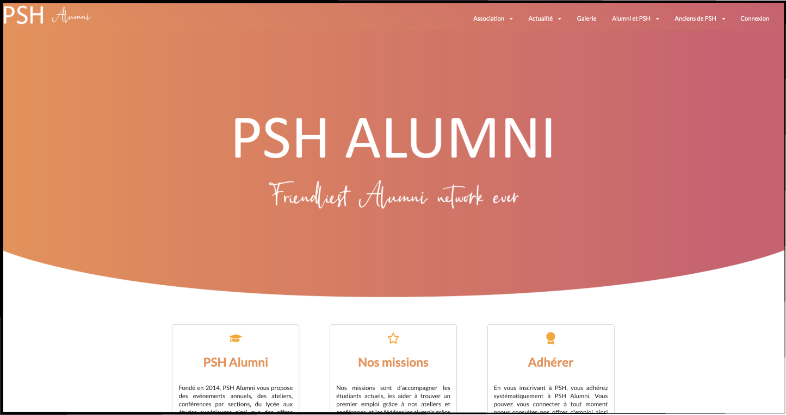

## PSH Alumni Website

### Installation

To install the project:

- Clone the repo
- npm install
- Go to firebase and copy pase your credentials
- npm start

### Features

- General pages to present the association
- Authentication page (connection/forgot password)
- Event management (possibility to add / confirm events participation)
- Job management (possibility to add / reply to job ads)
- Important admin panel (with the possibility to register students)

### Tech Stack

For this project, I used:

- React JS
- Google Services (Firebase for authentication and for database)
- CKEditor
- Material UI
- Sass
- Semantic UI